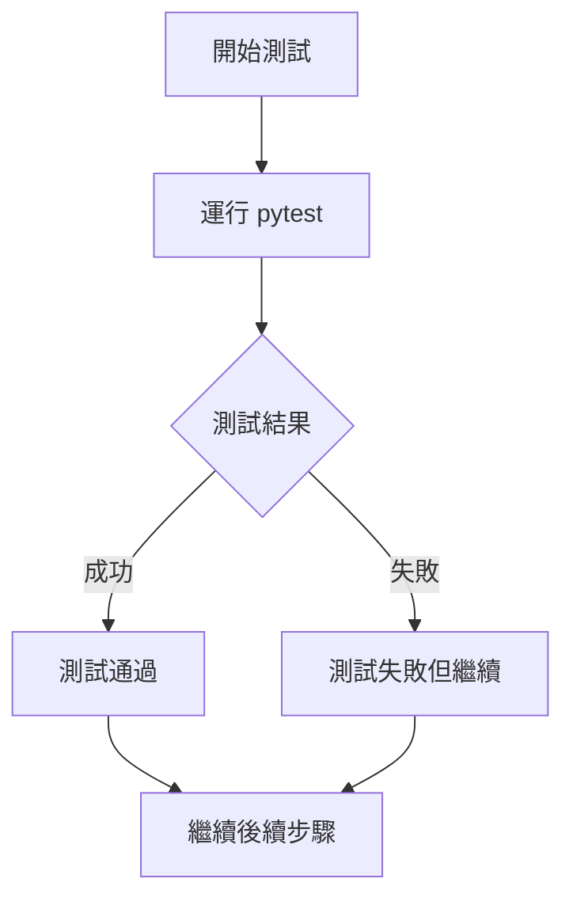
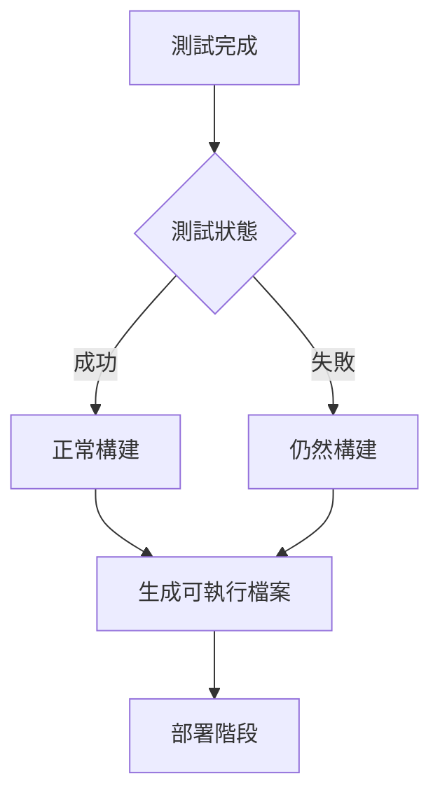
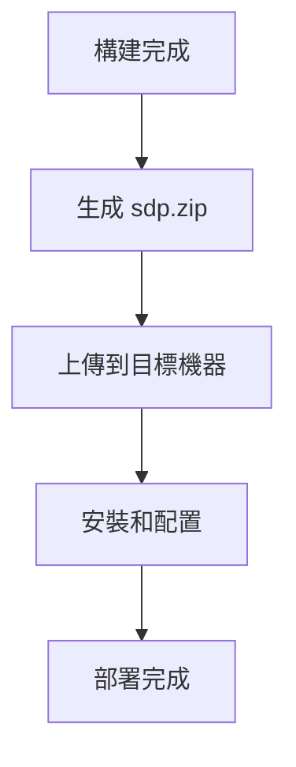

# Build.yml 修改總結

## 🎯 修改目標

修改 `.github/workflows/build.yml` 檔案，使得即使 pytest 測試失敗，後續的 Git Actions workflow 仍然可以繼續執行，確保構建和部署流程不會因為測試問題而中斷。

## 🚨 原始問題

### 1. 依賴關係問題

**原始配置**:
```yaml
build:
  name: Build Executables
  runs-on: ubuntu-24.04
  needs: test  # 依賴於 test 作業成功
  
security:
  name: Security Scan
  runs-on: ubuntu-24.04
  needs: test  # 依賴於 test 作業成功
```

**問題**: 如果 `test` 作業失敗（例如 pytest 失敗），`build` 和 `security` 作業就不會執行，導致整個構建和部署流程中斷。

### 2. 測試失敗影響

- ❌ **構建作業被阻止**: 無法生成可執行檔案
- ❌ **安全掃描被阻止**: 無法進行安全檢查
- ❌ **部署流程中斷**: 無法部署到目標機器
- ❌ **開發效率降低**: 需要修復所有測試問題才能繼續

## 🔧 實施的修改

### 1. 添加 continue-on-error 到 pytest 步驟

**修改前**:
```yaml
- name: Run tests with pytest
  run: |
    pytest tests/ -v --cov=. --cov-report=xml
```

**修改後**:
```yaml
- name: Run tests with pytest
  run: |
    pytest tests/ -v --cov=. --cov-report=xml
  continue-on-error: true
```

**修改原理**: 即使 pytest 失敗，該步驟也不會導致整個作業失敗，而是會繼續執行後續步驟。

### 2. 添加 if: always() 到依賴作業

**修改前**:
```yaml
build:
  name: Build Executables
  runs-on: ubuntu-24.04
  needs: test

security:
  name: Security Scan
  runs-on: ubuntu-24.04
  needs: test
```

**修改後**:
```yaml
build:
  name: Build Executables
  runs-on: ubuntu-24.04
  needs: test
  if: always()

security:
  name: Security Scan
  runs-on: ubuntu-24.04
  needs: test
  if: always()
```

**修改原理**: `if: always()` 確保即使 `test` 作業失敗，這些作業仍然會執行。

## ✅ 修改後的優勢

### 1. 工作流程穩定性

- **✅ 測試失敗不阻斷構建**: 即使測試有問題，仍然可以構建可執行檔案
- **✅ 持續部署能力**: 確保部署流程不會因為測試問題而中斷
- **✅ 開發效率提升**: 可以在修復測試的同時繼續其他工作

### 2. 錯誤處理改進

- **✅ 優雅降級**: 測試失敗時，其他功能仍然正常運作
- **✅ 問題隔離**: 測試問題不會影響構建和部署流程
- **✅ 快速反饋**: 可以快速識別和修復測試問題

### 3. 業務連續性

- **✅ 生產部署**: 即使測試有問題，生產環境的部署不會中斷
- **✅ 緊急修復**: 可以快速部署緊急修復，而不需要等待所有測試通過
- **✅ 風險降低**: 降低因測試問題導致的部署失敗風險

## 🔍 修改後的執行流程

### 1. 測試階段


### 2. 構建階段


### 3. 部署階段


## 📋 修改的檔案清單

1. **`.github/workflows/build.yml`**: 主要修改檔案
   - 添加 `continue-on-error: true` 到 pytest 步驟
   - 添加 `if: always()` 到 build 和 security 作業

## 🚀 使用建議

### 1. 測試優先級

- **高優先級**: 修復導致構建失敗的測試
- **中優先級**: 修復影響核心功能的測試
- **低優先級**: 修復邊緣情況的測試

### 2. 監控和報告

- **測試狀態**: 定期檢查測試結果
- **覆蓋率報告**: 監控測試覆蓋率變化
- **失敗分析**: 分析測試失敗的根本原因

### 3. 持續改進

- **測試穩定性**: 提高測試的穩定性和可靠性
- **測試覆蓋率**: 增加測試覆蓋率
- **測試維護**: 定期維護和更新測試

## 📝 總結

這次修改成功解決了 pytest 失敗阻斷整個 workflow 的問題：

### 關鍵改進

1. **✅ 工作流程穩定性**: 測試失敗不再阻斷構建和部署
2. **✅ 業務連續性**: 確保生產環境的持續部署能力
3. **✅ 開發效率**: 提高開發和部署的效率
4. **✅ 錯誤隔離**: 測試問題不會影響其他功能

### 修改策略

- **continue-on-error**: 允許測試步驟失敗而不中斷作業
- **if: always()**: 確保依賴作業始終執行
- **優雅降級**: 在測試失敗時仍能提供核心功能

現在你的 Git Actions workflow 更加穩定和可靠，即使測試有問題，仍然可以繼續構建和部署！🎉

---

**狀態**: ✅ 完成  
**修改檔案**: 1 個  
**影響範圍**: 測試、構建、部署流程  
**穩定性提升**: 顯著改善
