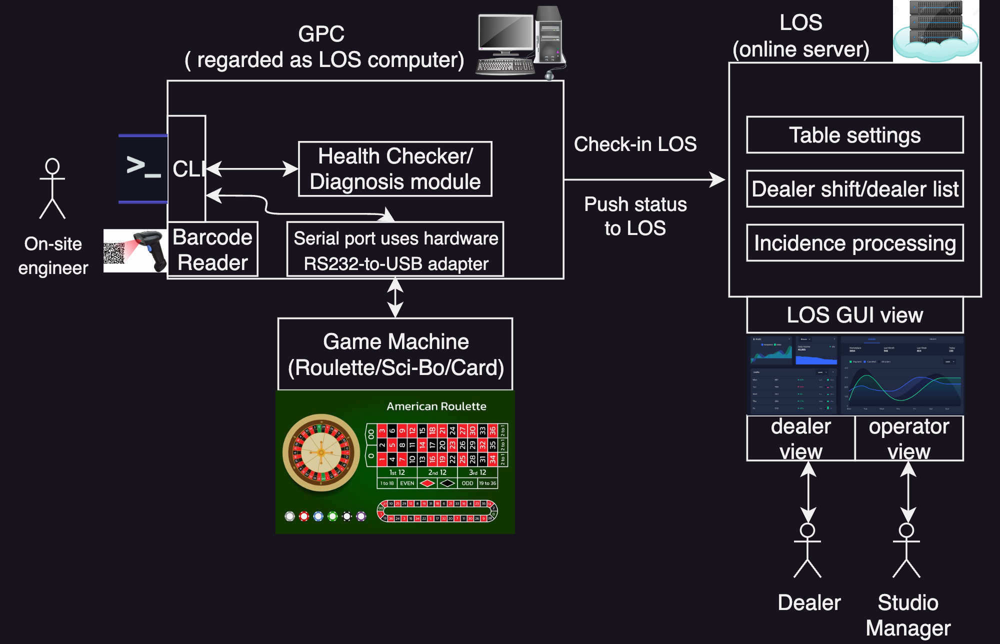

# studio-sdp-roulette

### Requirements
* Python 3.9+ (only tested on 3.9)
* PySerial (imported as serial)
* For MacOS, due to depreciation of system-level pip install, need to create venv for pip installation:
```bash
python3 -m venv .venv
source .venv/bin/activate
python3 -m pip install pyserial
```

## Overview Architecture



### TODO
- [ ] The reusability of the module design for IDP (image data processor, on the media server side), to be opened as Jira issue under the SDP epic, more specifically, focusing on the main loop design and how to migrate to the Sci-bo game.
- [ ] The implementation of websocket communication between SDP and IDP, to be opened as Jira issue under the SDP epic.
- [ ] Not urgent: study handler with C on MCU, Linux socket and SRS for IDP.

## SDP (serial data processor) design 

## sdp-prototype.py 

Serail data processor main module.
See the [design doc](SDP-design.md) for more details.

### Usage
```bash
python3 sdp-prototype.py
```
The demonstrative output shows as below:


## Code for Test 
### serial-port-sim.py: 
The aim of this script is to create a virtual serial port and send data
to simulate the behavior from/to the Roulette machine and the LOC computer.
Currently the both two ends of serial ports are created on the same MacOS notebook,
hence it is a loopback.
The data is generated following the specified game protocol format:
*X:{x:01d}:{y:03d}:{z:02d}:{a:01d}:{b:03d}:{c:01d}
The specific ranges of each fields in the game protocol is going to be checked.

#### Usage
```bash
python3 serial-port-sim.py
```
The demonstrative output shows as below:


### img-serial-sim.py: 
The aim of this script is to create a virtual serial port and send image data
to simulate the behavior from/to the Sci-bo game machine and the SDP.

#### Usage
```bash
python3 img-serial-sim.py
```
The demonstrative output shows as below:
```bash
Created virtual serial port: /dev/ttys034
Sender opened on /dev/ttys034 at 115200 bps
Receiver opened on /dev/ttys034 at 115200 bps
```
