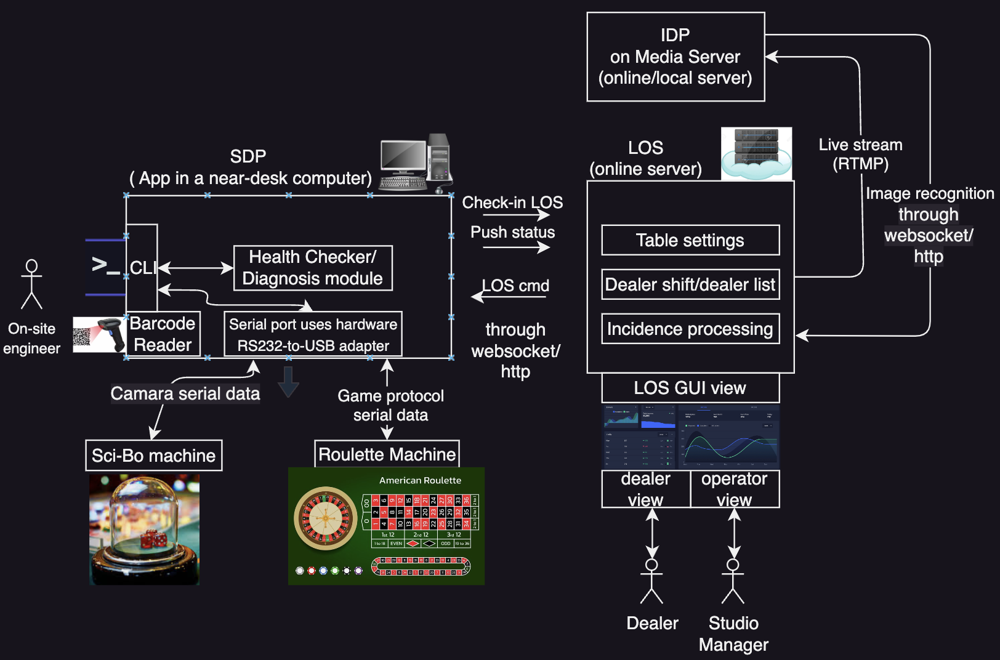

# studio-sdp-roulette

### Requirements
* Python 3.9+ (only tested on 3.9)
* PySerial (imported as serial)
* For MacOS, due to depreciation of system-level pip install, need to create venv for pip installation:
```bash
python3 -m venv .venv
source .venv/bin/activate
python3 -m pip install pyserial requests flask
```

## Overview Architecture



### TODO
- [ ] The reusability of the module design for IDP (image data processor, on the media server side), to be opened as Jira issue under the SDP epic, more specifically, focusing on the main loop design and how to migrate to the Sci-bo game.
- [ ] The implementation of websocket communication between SDP and IDP, to be opened as Jira issue under the SDP epic.
- [ ] Not urgent: study handler with C on MCU, Linux socket and SRS for IDP.

## SDP (serial data processor) design 

### Code structure

```
src/refactoring/
├── __init__.py
├── main.py
├── gui.py
├── state_machine.py
├── communication/
│   ├── __init__.py
│   ├── los_communication.py
│   ├── websocket_communication.py
│   ├── http_communication.py
│   └── roulette_communication.py
└── processors/
    ├── __init__.py
    ├── data_processor.py
    ├── sdp.py
    └── idp.py
```

### Usage

```bash
python3 main.py
```
The expected output
```bash
Created virtual serial port: /dev/ttys029
Serial port initialized successfully
WebSocket communication started
HTTP server started
Starting GUI...
Updating log...
Adding message to log: GUI initialized
Adding message to log: Waiting for system messages...
Adding message to log: State Machine initialized
2024-09-26 17:41:42.751 Python[650:16645140] WARNING: Secure coding is automatically enabled for restorable state! However, not on all supported macOS versions of this application. Opt-in to secure coding explicitly by implementing NSApplicationDelegate.applicationSupportsSecureRestorableState:.
Updating log...
Adding message to log: GUI is running
Updating log...
Updating log...
Updating log...
Updating log...
Updating log...
Updating log...
Updating log...
Updating log...
Updating log...
Processing roulette polling results: *X:1:950:25:0:992:0
SDP status updated as: ROULETTE_ID_1_DATA_992
Updating log...
...
```

# Test Design

See the [doc](doc/test_design.md)  for more details.

# Indivisualized Roulette/SDP/LOS simulators (developing...)

See the [doc](sim/README_sim.md)  for more details.