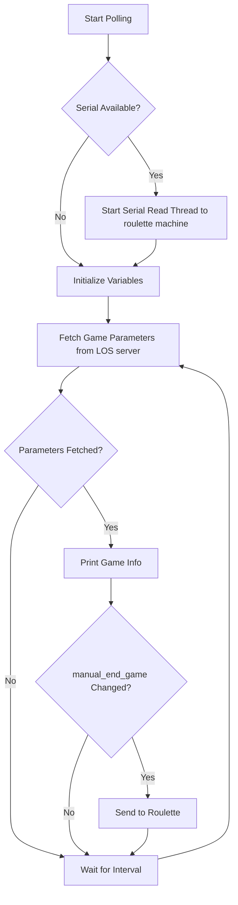

# studio-sdp-roulette

### Requirements
* Python 3.9+ (only tested on 3.9)
* PySerial (imported as serial)
* For MacOS, due to depreciation of system-level pip install, need to create venv for pip installation:
```bash
python3 -m venv .venv
source .venv/bin/activate
python3 -m pip install pyserial requests flask
```

## Overview Architecture


### TODO
- [ ] The reusability of the module design for IDP (image data processor, on the media server side), to be opened as Jira issue under the SDP epic, more specifically, focusing on the main loop design and how to migrate to the Sci-bo game.
    - Current status: the primitive common interface for sdp/idp is implemented in the src/refactoring/processors (`sdp` branch, pending)
- [ ] The implementation of websocket communication between SDP and IDP, to be opened as Jira issue under the SDP epic.

---

## Currently switching to the `sim` branch

### Implementation Progress


### The main loop logic of `SDP` is implemented in the `start_polling` function in the `sdp_client_sim.py`



see the [doc](sim/README_sim.md)  for more details about other simulator components (LOS/manager behavior, roulette machine) and how to execute simulators.

## (Pending) branch `sdp`

see the [doc](src/refactoring/README.md)  for more details.