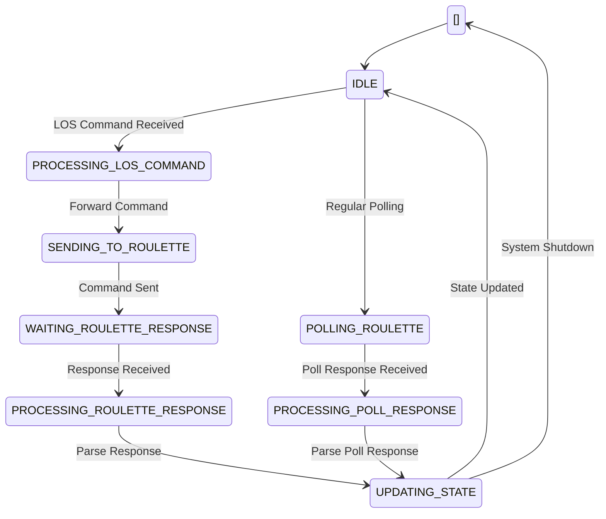

# SDP-design

## System Components

### 1. SDPStateMachine (Serial Data Processor State Machine)

- Maintains the current state of the system
- Provides a thread-safe method for state updates

### 2. LOSCommunication (Live Operation System Communication)

- Simulates receiving LOS commands
- Processes received commands, updates the state machine, and forwards to the roulette communication module

### 3. RouletteCommunication (Roulette Communication)

- Communicates with the roulette machine using a virtual serial port
- Regularly polls the roulette machine status
- Processes polling results and updates the state machine
- Receives and sends commands from LOS to the roulette machine

### 4. Main Function Logic

- Initializes various modules
- Starts multiple threads to handle different tasks
- Periodically prints the current system state

## Program Flow

### 1. LOS Command Processing

User input -> LOSCommunication receives -> Updates state machine -> Forwards to RouletteCommunication

### 2. Roulette Machine Polling

RouletteCommunication sends periodic polling commands -> Receives response or generates simulated response -> Parses results -> Updates state machine

### 3. State Updates

Various modules update the state machine as needed -> Main loop periodically prints current state

## Implementation Details

This program uses multithreading to handle concurrent tasks, passes data between threads using queues, and simulates communication with actual hardware using a virtual serial port. The overall design aims to simulate a real-time response system, processing commands from the Live Operation System (LOS) and interacting with the roulette machine.

Currently provide websocket/http communication placeholder modules for testing.

## State Diagram of SDP

## Mocked LOS Design
Enumerate all possible LOS command events. (Kimi will provide them next week)
