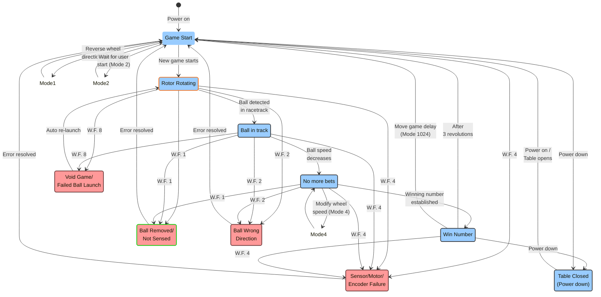

# Changing Gaming Mode and Roulette Mode Options

```
*o<mode> <enter>
```
Returns value of:
```
*o<mode>
```
To set the game mode enter the command `*o (mode) <enter>`

Asterisk lowercase ‘O’ space mode value enter key

This will change the gaming mode based on the options listed in the following table.

The mode value (<mode>) is the sum of the mode option values from the table.

The default mode is *o 1157


| Mode Option | Description | Mode Value |
|-------------|-------------|------------|
| Reverse wheel each game | Plays each game in opposite direction to the previous game. If not enabled, wheel only game rotates clockwise. | 1 |
| User game start | Waits for external user key 1 press, *u 1 or *K before starting next game. | 2 |
Modify Wheel Speed after no more bets| Modifies the speed of the wheel by a random amount after no more bets. | 4 |
| Disable Single Winning number | Disables output of single winning number in protocol output stream. | 16 |
|Automatic Status Outputs | the status of the wheel every 0.5 seconds | 128
Output *F Error Messages during Play | Outputs *F errors in output protocol stream. Error Codes — Developers Guide - 24 | 256
|Move Game Delay | Move games per hour delay from state 5 to 1 | 1024


Factory set game mode is 1157, comprising of:

- Value 1 - Reverse wheel each game.
- Value 4 — Modify wheel speed after no more bets(active rotor control).
- Value 128 — Automatic status updates every 0.5 seconds.
- Value 1024 — Move game per hour delay from state 5 to state 1.

