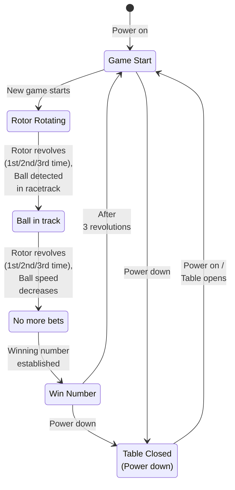
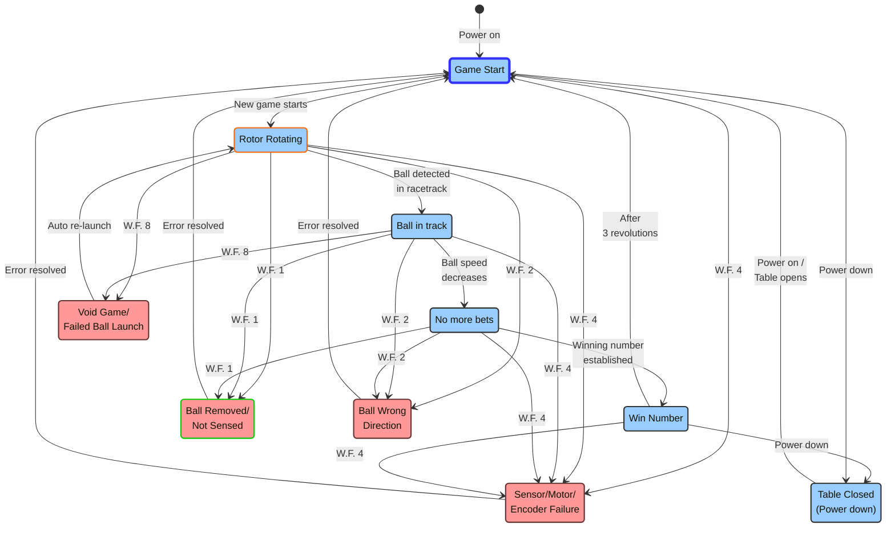
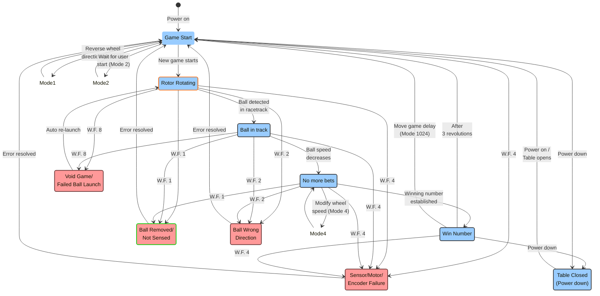

# Roulette State Machine and SDP corresponding state transition

## Roulette State Machine
Reference: Owner's Handbook,p.49

- *X;1 - State 1: Game Start
    - indicates the rotor is revolving in a table closed mode (from state 6), or after 3 revolutions of the rotor after the winning number state has occurred. (from 3 times "state 2 -> state 3 -> state 4 -> state 5")
- *X:2 - State 2: Rotor Rotating
    - indicates the rotor is revolving and a new game is being started. (game running in a round)
- *X:3 - State 3: Ball in track
    - indicates a ball has been detected in the racetrack by all three in-rim sensors, i.e. one revolution of the ball.(game running in a round)
- *X:4 - State 4: No more bets
    - indicates the No More Bets state, (the speed of the ball has decreased below the set time value between in-rim sensors).(game running in a round)
- *X:5 - State 5: Win Number
    - indicates Winning Number has been established, by all in-rim sensors detecting the ball in a valid pocket during state 4, with no game errors present.
- *X:6 - State 6: Table Closed (Power down)
    - indicates that the table is closed or the wheel has been powered down.



### Warning Flags

Warning Flags: The warning flag outputs a live hexadecimal sum value of occurring faults.
- Value 1: warning flag indicates the ball has been removed from the wheel or has not been sensed by the rim sensors.
- Value 2: warning flag indicates the ball is travelling in the same direction as the rotor.
- Value 4: indicates failure of an in-rim sensor, or the motor or encoder.
- Value 8 indicates a void game and failed ball launch. The controller will automatically
attempt to re-launch the ball.

Roulette machine considering the warning flags:



### Roulette State Machine consideringChanging Gaming Mode and Roulette Mode Options

```
*o<mode> <enter>
```
Returns value of:
```
*o<mode>
```
To set the game mode enter the command `*o (mode) <enter>`

Asterisk lowercase ‘O’ space mode value enter key

This will change the gaming mode based on the options listed in the following table.

The mode value (<mode>) is the sum of the mode option values from the table.

The default mode is *o 1157


| Mode Option | Description | Mode Value |
|-------------|-------------|------------|
| Reverse wheel each game | Plays each game in opposite direction to the previous game. If not enabled, wheel only game rotates clockwise. | 1 |
| User game start | Waits for external user key 1 press, *u 1 or *K before starting next game. | 2 |
Modify Wheel Speed after no more bets| Modifies the speed of the wheel by a random amount after no more bets. | 4 |
| Disable Single Winning number | Disables output of single winning number in protocol output stream. | 16 |
|Automatic Status Outputs | the status of the wheel every 0.5 seconds | 128
Output *F Error Messages during Play | Outputs *F errors in output protocol stream. Error Codes — Developers Guide - 24 | 256
|Move Game Delay | Move games per hour delay from state 5 to 1 | 1024


Factory set game mode is 1157, comprising of:

- Value 1 - Reverse wheel each game.
- Value 4 — Modify wheel speed after no more bets(active rotor control).
- Value 128 — Automatic status updates every 0.5 seconds.
- Value 1024 — Move game per hour delay from state 5 to state 1.




# Usage
```bash
python LOS_server_sim.py
python roulette_sim.py # record the port number
python SDP_client_sim.py /dev/ttyps{port number}
python manager_sim.py
```

## Initialized output

### LOS_server_sim.py
```
(.venv) kevin.k@MacBook-Pro ~/s/sim (sdp)> python LOS_server_sim.py 
 * Serving Flask app 'LOS_server_sim'
 * Debug mode: on
WARNING: This is a development server. Do not use it in a production deployment. Use a production WSGI server instead.
 * Running on all addresses (0.0.0.0)
 * Running on http://127.0.0.1:5000
 * Running on http://10.13.81.73:5000
Press CTRL+C to quit
127.0.0.1 - - [27/Sep/2024 16:16:14] "GET /get_game_parameters HTTP/1.1" 200 -
127.0.0.1 - - [27/Sep/2024 16:16:19] "GET /get_game_parameters HTTP/1.1" 200 -
127.0.0.1 - - [27/Sep/2024 16:16:24] "GET /get_game_parameters HTTP/1.1" 200 -
```
### roulette_sim.py
```
(.venv) kevin.k@MacBook-Pro ~/s/sim (sdp)> python roulette_sim.py 
Created virtual serial port: /dev/ttys038
Roulette simulator is running. Virtual port: /dev/ttys038
Press Ctrl+C to stop the simulator.
Roulette simulator sent: *X:2:552:24:0:439:1
Roulette simulator sent: *X:3:361:25:0:281:0
Roulette simulator sent: *X:1:438:24:1:009:1
Roulette simulator sent: *X:3:138:26:0:489:1
Roulette simulator sent: *X:2:960:27:1:234:1
Roulette simulator sent: *X:1:623:28:1:561:1
Roulette simulator sent: *X:2:052:26:0:031:1
Roulette simulator sent: *X:1:773:26:1:433:1
Game status: running
Game mode: standard
Last updated: 1727428680.836295
```

### SDP_client_sim.py
```
(.venv) kevin.k@MacBook-Pro ~/s/sim (sdp)> python SDP_client_sim.py /dev/ttys038 
/Users/kevin.k/studio-sdp-roulette/.venv/lib/python3.9/site-packages/urllib3/__init__.py:35: NotOpenSSLWarning: urllib3 v2 only supports OpenSSL 1.1.1+, currently the 'ssl' module is compiled with 'LibreSSL 2.8.3'. See: https://github.com/urllib3/urllib3/issues/3020
  warnings.warn(
Game status: running
Game mode: standard
Last updated: 1727424972.313292
---
Received from roulette: *X:2:149:25:0:753:0
Received from roulette: *X:3:547:28:1:687:0
Received from roulette: *X:3:479:26:0:199:0
Received from roulette: *X:2:536:24:1:287:0
Received from roulette: *X:1:886:27:1:882:0
```

## Scenario: with manager manipulation

### manager_sim.py

Currently, the simulated behavior is send set_game_parameter request to the LOS server simulator every 2 seconds. (enable/disable manual end game)

```
Manager simulator started. Press Ctrl+C to stop.
Successfully set manual_end_game to True
Successfully set manual_end_game to False
Successfully set manual_end_game to True
Successfully set manual_end_game to False
```


Then the LOS server will receive like:
```bash
127.0.0.1 - - [30/Sep/2024 09:34:09] "GET /get_game_parameters HTTP/1.1" 200 -
127.0.0.1 - - [30/Sep/2024 09:34:14] "GET /get_game_parameters HTTP/1.1" 200 -
127.0.0.1 - - [30/Sep/2024 09:34:19] "GET /get_game_parameters HTTP/1.1" 200 -
127.0.0.1 - - [30/Sep/2024 09:34:19] "POST /set_game_parameter HTTP/1.1" 200 -
127.0.0.1 - - [30/Sep/2024 09:34:21] "POST /set_game_parameter HTTP/1.1" 200 -
127.0.0.1 - - [30/Sep/2024 09:34:23] "POST /set_game_parameter HTTP/1.1" 200 -
127.0.0.1 - - [30/Sep/2024 09:34:24] "GET /get_game_parameters HTTP/1.1" 200 -
127.0.0.1 - - [30/Sep/2024 09:34:25] "POST /set_game_parameter HTTP/1.1" 200 -
```
The SDP client will receive like:
```bash
---
Received from roulette: *X:3:961:25:0:516:1
Game status: running
Game mode: standard
Last updated: 1727660462.052375
Manual end game: False
---
Game status: running
Game mode: standard
Last updated: 1727660467.0561721
Manual end game: True
Sent to roulette: *X:1:000:24:0:000:1
---
Received from roulette: *X:3:432:25:1:878:1
Game status: running
Game mode: standard
Last updated: 1727660472.0612428
Manual end game: True
---
Game status: running
Game mode: standard
Last updated: 1727660477.0663218
Manual end game: False
Sent to roulette: *X:1:000:24:0:000:0
---
Received from roulette: *X:2:194:28:0:232:0
Game status: running
Game mode: standard
Last updated: 1727660482.071397
Manual end game: False
```

## Exception handling

- [x] LOS determines whether it's in an open game state based on the game status transmitted by SDP. If not, it blocks SDP's GET request.

The expected output of LOS is like:

```
127.0.0.1 - - [30/Sep/2024 17:03:45] "GET /get_game_parameters HTTP/1.1" 403 -
127.0.0.1 - - [30/Sep/2024 17:03:46] "POST /set_game_parameter HTTP/1.1" 200 -
127.0.0.1 - - [30/Sep/2024 17:03:48] "POST /set_game_parameter HTTP/1.1" 200 -
127.0.0.1 - - [30/Sep/2024 17:03:50] "POST /set_game_parameter HTTP/1.1" 200 -
127.0.0.1 - - [30/Sep/2024 17:03:50] "GET /get_game_parameters HTTP/1.1" 403 -
127.0.0.1 - - [30/Sep/2024 17:03:52] "POST /set_game_parameter HTTP/1.1" 200 -
127.0.0.1 - - [30/Sep/2024 17:03:54] "POST /set_game_parameter HTTP/1.1" 200 -
127.0.0.1 - - [30/Sep/2024 17:03:55] "GET /get_game_parameters HTTP/1.1" 403 -
...
```

The expected output of SDP is like:

```
Get game parameters error: 403 Client Error: FORBIDDEN for url: http://localhost:5000/get_game_parameters
Get game parameters error: 403 Client Error: FORBIDDEN for url: http://localhost:5000/get_game_parameters
Get game parameters error: 403 Client Error: FORBIDDEN for url: http://localhost:5000/get_game_parameters
Get game parameters error: 403 Client Error: FORBIDDEN for url: http://localhost:5000/get_game_parameters
Get game parameters error: 403 Client Error: FORBIDDEN for url: http://localhost:5000/get_game_parameters
Get game parameters error: 403 Client Error: FORBIDDEN for url: http://localhost:5000/get_game_parameters
```

- [ ] During an open game state, when LOS receives a POST request from the manager, it checks if it's a valid request. If valid, it responds; if invalid, it returns a 403 error.

- [ ] LOS uses the table ID transmitted by SDP to confirm which table the received request belongs to. If the request doesn't belong to that table, it returns a 403 error.