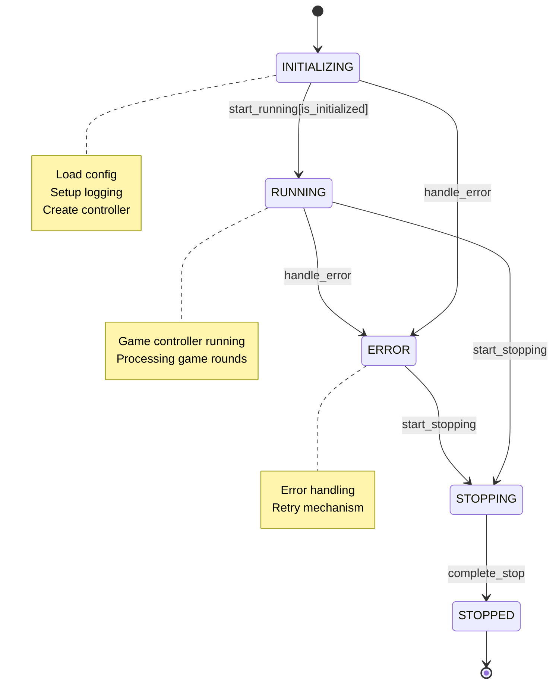
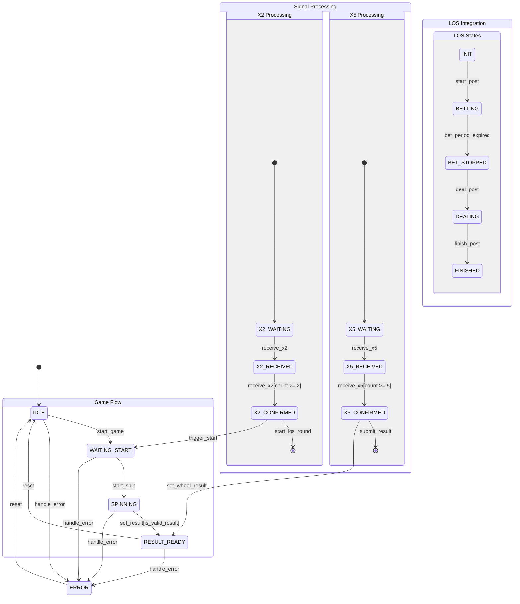
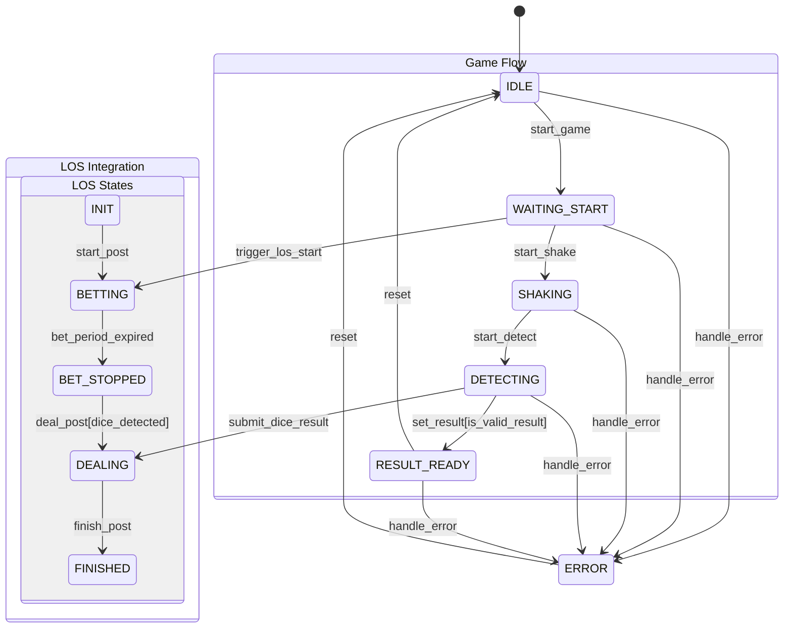
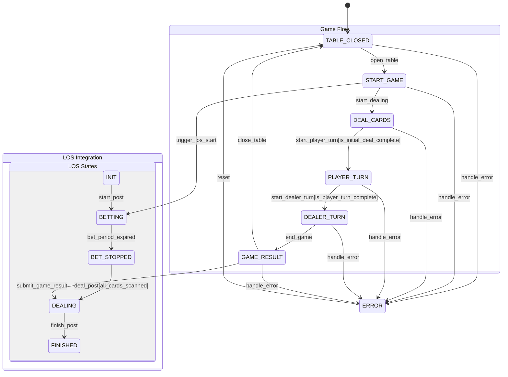
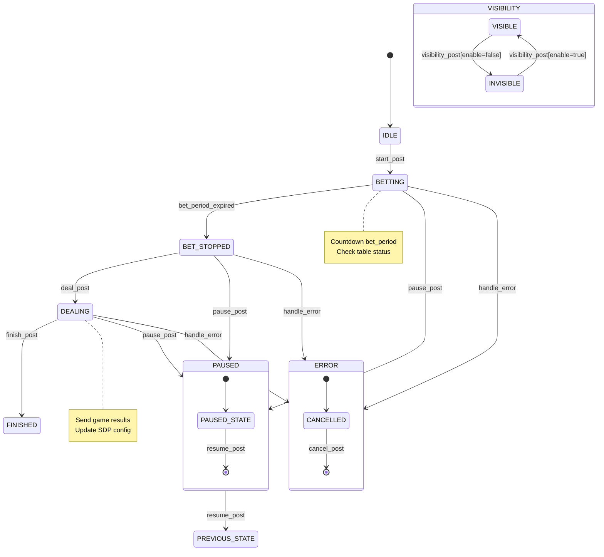
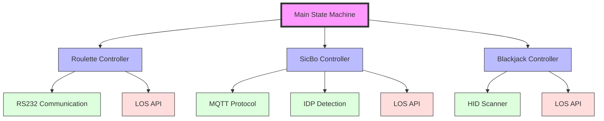

# SDP Game System Refactoring

This document describes the hierarchical state machine structure of the SDP game system.

## Main Program State Machine

## Game Controllers State Machines

### Roulette Controller (RS232 + LOS Integration)

### SicBo Controller (MQTT + IDP + LOS Integration)

### Blackjack Controller (HID + LOS Integration)

## LOS API State Machine

## Updated Hierarchical Structure

## State Machine Descriptions

### Main State Machine
- Controls overall program flow
- Manages game type selection and initialization
- Handles high-level error cases
- Coordinates resource cleanup

### Game Controllers
Each game controller manages its specific game logic and device communication:

#### Roulette Controller
- Manages roulette wheel via RS232
- Controls game rounds and result detection
- Handles wheel speed and positioning

#### SicBo Controller
- Controls dice shaker via MQTT
- Uses IDP for dice detection
- Manages shake patterns and result validation

#### Blackjack Controller
- Uses HID barcode scanner for card detection
- Manages game rounds and player turns
- Handles card validation and game rules

## Communication Protocols
- **RS232**: Serial communication for roulette wheel control
- **MQTT**: Message queue for dice shaker control
- **IDP**: Image detection for dice results
- **HID**: Human Interface Device for card scanning

## LOS API State Descriptions

### Game Flow States
- **IDLE**: Initial state waiting for game start
- **BETTING**: Active betting period with countdown
- **BET_STOPPED**: Betting period ended, ready for dealing
- **DEALING**: Processing game results
- **FINISHED**: Round completed

### Control States
- **PAUSED**: Game temporarily suspended
  - Can be triggered from any active state
  - Requires reason for pause
  - Resume returns to previous state

### Visibility States
- **VISIBLE**: Table visible to players
- **INVISIBLE**: Table hidden from players

### Error Handling
- **CANCELLED**: Round cancelled due to error
- Supports round cancellation and recovery

## LOS API Functions
- **start_post**: Initiate new game round
- **deal_post**: Submit game results
- **finish_post**: Complete current round
- **pause_post**: Temporarily suspend game
- **resume_post**: Resume suspended game
- **visibility_post**: Control table visibility
- **cancel_post**: Cancel current round
- **get_roundID**: Check current round status
- **sdp_config_post**: Update game configuration

## Integration Points
Each game controller (Roulette, SicBo, Blackjack) integrates with LOS API for:
- Round management
- Result submission
- State control
- Configuration updates
- Error handling

## State Descriptions

### Roulette Signal States
- **X2 Processing**
  - X2_WAITING: Waiting for X2 signal
  - X2_RECEIVED: First X2 signal received
  - X2_CONFIRMED: Multiple X2 signals confirmed (triggers game start)
- **X5 Processing**
  - X5_WAITING: Waiting for X5 signal
  - X5_RECEIVED: First X5 signal received
  - X5_CONFIRMED: Multiple X5 signals confirmed (triggers result submission)

### LOS Integration States for Each Game
- **INIT**: Initial state before round starts
- **BETTING**: Active betting period
- **BET_STOPPED**: Betting period ended
- **DEALING**: Submitting game results
- **FINISHED**: Round completed

### Integration Points with LOS
1. **Roulette**:
   - X2 signals trigger LOS round start
   - X5 signals trigger result submission
   - Wheel position validation before result submission

2. **SicBo**:
   - Shake command triggers LOS round start
   - IDP detection triggers result submission
   - Dice validation before result submission

3. **Blackjack**:
   - Table opening triggers LOS round start
   - Card scanning during dealing phase
   - Final hand results trigger round completion
