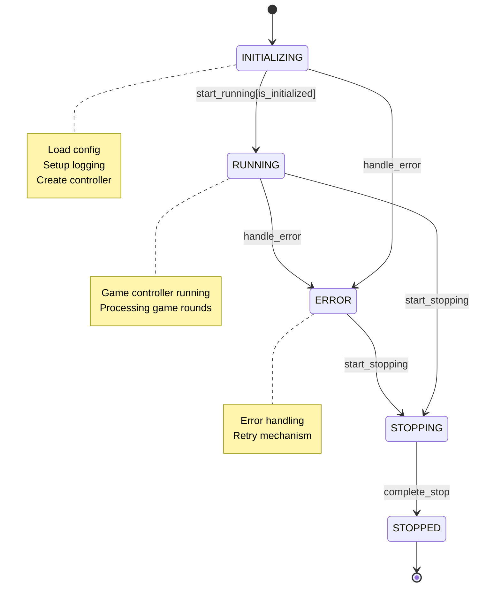
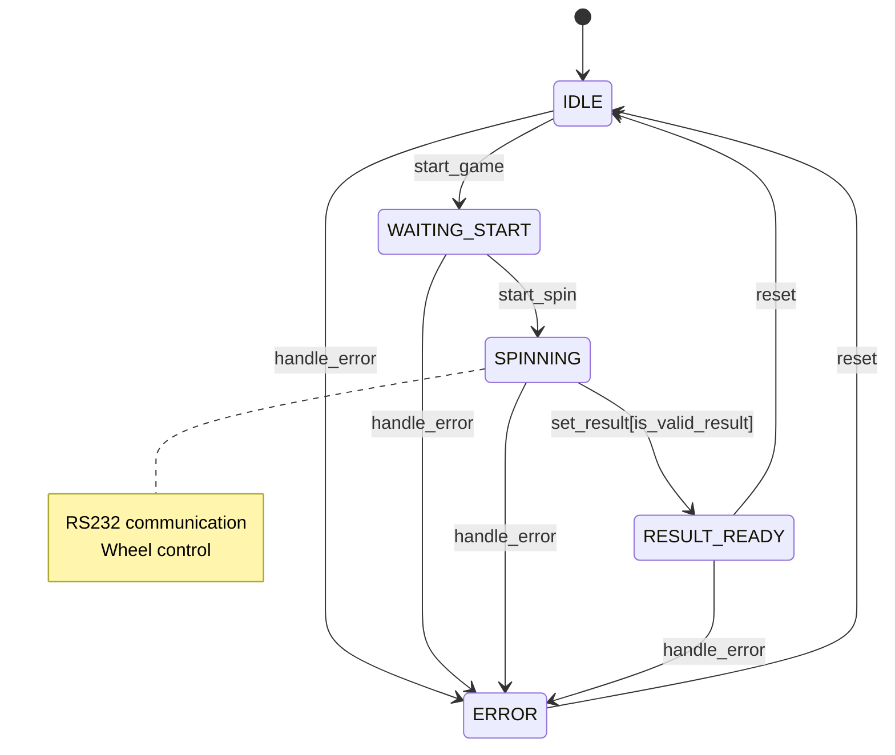
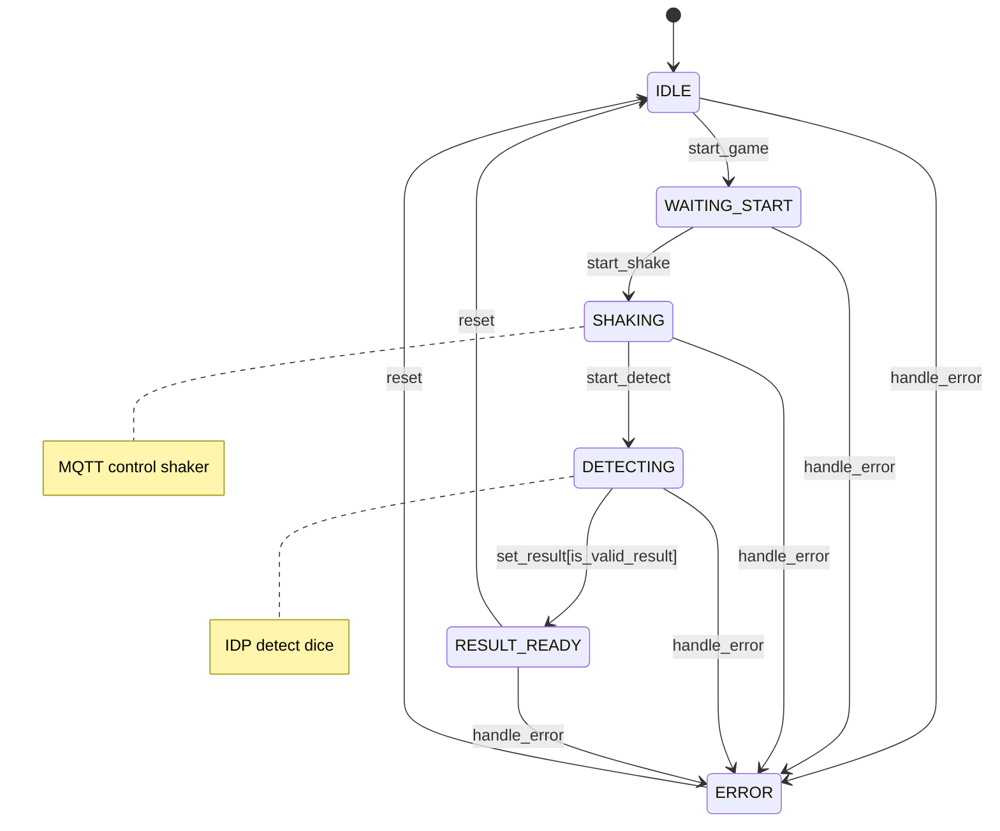
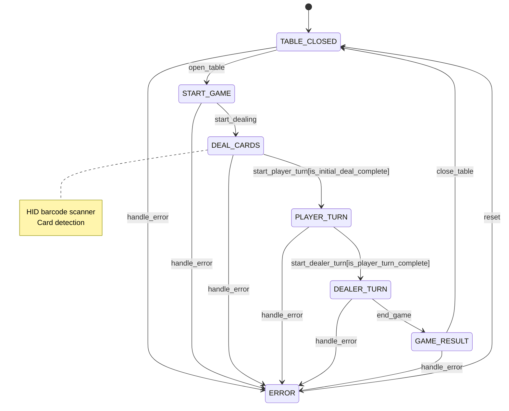
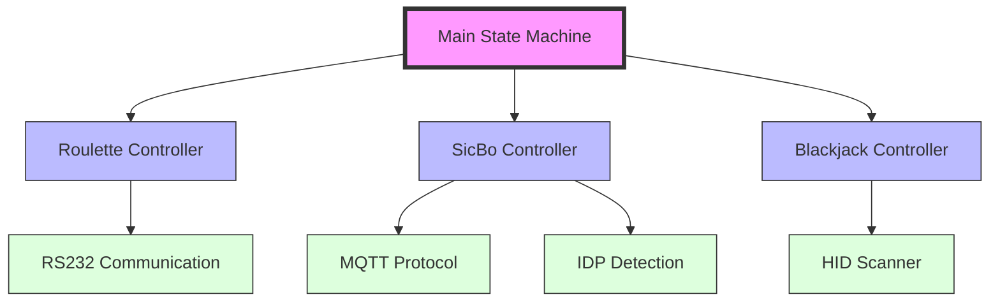

# SDP Game System Refactoring

This document describes the hierarchical state machine structure of the SDP game system.

## Main Program State Machine

## Game Controllers State Machines

### Roulette Controller (using RS232)

### SicBo Controller (using IDP and MQTT)

### Blackjack Controller (using HID)

## Hierarchical Structure

## State Machine Descriptions

### Main State Machine
- Controls overall program flow
- Manages game type selection and initialization
- Handles high-level error cases
- Coordinates resource cleanup

### Game Controllers
Each game controller manages its specific game logic and device communication:

#### Roulette Controller
- Manages roulette wheel via RS232
- Controls game rounds and result detection
- Handles wheel speed and positioning

#### SicBo Controller
- Controls dice shaker via MQTT
- Uses IDP for dice detection
- Manages shake patterns and result validation

#### Blackjack Controller
- Uses HID barcode scanner for card detection
- Manages game rounds and player turns
- Handles card validation and game rules

## Communication Protocols
- **RS232**: Serial communication for roulette wheel control
- **MQTT**: Message queue for dice shaker control
- **IDP**: Image detection for dice results
- **HID**: Human Interface Device for card scanning
